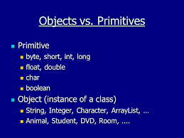
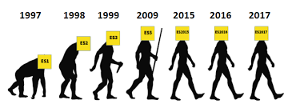

## Ман аз лексия фахмидам ки JS ягона забони программисти мебошад ки барои front-end даркор мешавад 
# Data Types
## Дата тайпхо 2 хел мешаванд Object ва Primitive

 
# Ки Js-ро навистаги аст ?
## Брендан Элич одаме ки Чава Скриптро дар 10 руз навистаги аст

# ЗАБОНИ Java Script-ро бо забони Java путать накунед ИН ДИГАР ДИГАР ЗАБОНХОЯНД
# Дар Js хаст ECMA Script
# Ecma Script стандарти Java Script  аст 
## Аз хама обновлении калони ECMA Script  соли 2015 шудаги аст

#
#
#
#
#
# Java Script ин забони front-end разработчикхо мебошаб ва харсол уро обновить мекунанд ки у аз back-end зависить накунад
 #
 #
 #
 #
 # JavaScript барои шурӯъкунандагон! Дар мақолаи аввали курс мо таърифи асосии JavaScript-ро медиҳем ва ба саволҳои “JavaScript чист?” ҷавоб медиҳем. ва "Ин чӣ кор мекунад?", мо мефаҳмем, ки чӣ тавр JavaScript кор мекунад ва чӣ гуна онро ба саҳифаи веб илова кардан мумкин аст.
#
#
#
#
#
#

