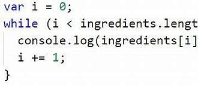

## Ман аз лексия фахмидам ки JS ягона забони программисти мебошад ки барои front-end даркор мешавад 
# Data Types
## Дата тайпхо 2 хел мешаванд Object ва Primitive

 
# Ки Js-ро навистаги аст ?
## Брендан Элич одаме ки Чава Скриптро дар 10 руз навистаги аст

# ЗАБОНИ Java Script-ро бо забони Java путать накунед ИН ДИГАР ДИГАР ЗАБОНХОЯНД
# Дар Js хаст ECMA Script
# Ecma Script стандарти Java Script  аст 
## Аз хама обновлении калони ECMA Script  соли 2015 шудаги аст

#
#
#
#
#
# Java Script ин забони front-end разработчикхо мебошаб ва харсол уро обновить мекунанд ки у аз back-end зависить накунад
 #
 #
 #
 #
 # JavaScript барои шурӯъкунандагон! Дар мақолаи аввали курс мо таърифи асосии JavaScript-ро медиҳем ва ба саволҳои “JavaScript чист?” ҷавоб медиҳем. ва "Ин чӣ кор мекунад?", мо мефаҳмем, ки чӣ тавр JavaScript кор мекунад ва чӣ гуна онро ба саҳифаи веб илова кардан мумкин аст.
#
#
#
#
#
#

# Condition дар  Js
## IF дар Js 3 намуд мешавад 
## 1.CONDITION If/else statement
## 2.CONDITION  Ternary operator
## 3.CONDITION  Switch statment

#
## If condition
## Используйте if, чтобы указать блок кода, который должен быть выполнен, если указанное условие истинно Используйте else, чтобы указать блок кода для выполнения, если то же условие ложно Используйте else if, чтобы указать новое условие для проверки, если первое условие ложно

#
## Ternary operator 
## Условный (тернарный) оператор является единственным оператором JavaScript, который принимает три операнда: условие, за которым следует вопросительный знак (?), затем выражение для выполнения, если условие истинно, за которым следует двоеточие (:), и, наконец, выражение для выполнения, если условие ложно. Этот оператор часто используется в качестве альтернативы оператору if... else.

#
## Switch Case 
## Единственное, что нужно, это switch(true){...} и чтобы выражения case вычислялись как логические значения.
## Это работает, потому что значение, которое мы даем переключателю, используется в качестве основы для сравнения. Следовательно, выражения case, также вычисляемые как логические значения, будут определять, какой case выполняется. Можно было бы также изменить это и передать switch(false){..} и получить желаемые выражения как false, а не true.. Но лично предпочитаю иметь дело с условиями, которые оцениваются как правдивость. 

#
#
#
#
#  Loop в Js

# Цикл For 
## Выполняется выражение начало, если оно указано. Это выражение обычно инициализирует один или несколько счётчиков, но синтаксис позволяет выражению быть любой сложности. Также используется для объявления переменных.
## Выполняется условие. Если условие истинно, то выполняются выражения. Если оно ложно, цикл for прерывается. Если же условие полностью пропущено, то оно считается истинным.
## Выполняются выражения. Чтобы выполнить несколько выражений, используются блок-выражение { ... } для группировки выражений.
## Обновляется шаг, если он есть, а затем управление возвращается к шагу 2.

#
#
# Цикл While 
## переходит к выражению после цикла.
## Условие проверяется на истинность до того, как выполняются выражения в цикле. Если условие истинно, выполняются выражения, а затем условие проверяется снова. Если условие ложно, выполнение приостанавливается и управление переходит к выражению после while.
## Чтобы использовать несколько выражений, используйте блок выражение { ... }, чтобы сгруппировать их.

#
#
# Цикл Do While
## выражения выполняются пока условие истинно. Чтобы использовать несколько выражений, используйте блок-выражение { ... }, чтобы сгруппировать их. Если условие истинно, выражения выполнятся снова. В конце каждого прохода условие проверяется. Если условие ложно, выполнение приостанавливается и управление передаётся выражению после do...while.

#
#
#
#
# Function в Js 

# Function Declaration
## Функции - ключевая концепция в JavaScript. Важнейшей особенностью языка является поддержка функции первого класса (functions as first-class citizen). Любая функция это объект, и следовательно ею можно манипулировать как объектом, в частности: передавать как аргумент и возвращать в качестве результата при вызове других функций функций высшего порядка; создавать анонимно и присваивать в качестве значений переменных или свойств объектов. Это определяет высокую выразительную мощность JavaScript и позволяет относить его к числу языков, реализующих функциональную парадигму программирования.
## Функция в JavaScript специальный тип объектов, позволяющий формализовать средствами языка определённую логику поведения и обработки данных.
## Для понимания работы функций необходимо (и достаточно?) иметь представление о следующих моментах:

#
#
# Function Expression 
## Вызов функции внутри себя используется для создания рекурсий. В этом примере именованное функциональное выражение имеет название factorialInner. По этому имени мы можем вызвать эту функцию внутри её же тела. Вне тела обратиться к этой функции по factorialInner нельзя.
## При этом функциональное выражение присвоено переменной factorial, объявленной с помощью const. Используя эту переменную (т.е. factorial) мы можем вызвать данную функцию.
# Function Expreession делятся на два типа 
# Anonymous Function и Arrow function

# Arrow function 
## Стрелочные функции, которые мы видели до этого, были очень простыми. Они брали аргументы слева от => и вычисляли и возвращали выражение справа.
## Иногда нам нужна более сложная функция, с несколькими выражениями и инструкциями. Это также возможно, нужно лишь заключить их в фигурные скобки. При этом важное отличие – в том, что в таких скобках для возврата значения нужно использовать return (как в обычных функциях).

#
#
# Anonymous function
## Обратите внимание, что если вы не поместите анонимную функцию в круглые скобки (), вы получите синтаксическую ошибку. Круглые скобки() превращают анонимную функцию в выражение, возвращающее объект функции.
## Анонимная функция недоступна после ее первоначального создания. Поэтому часто возникает необходимость присвоить его переменной. 

#
#
# IIFE function
## Это тип выражений, также известный как Self-Executing Anonymous Function, который состоит из двух основных частей. Первая - это сама анонимная функция с лексической областью видимости, заключённым внутри Оператора группировки (). Благодаря этому переменные IIFE замыкаются в его пределах, и глобальная область видимости ими не засоряется.
